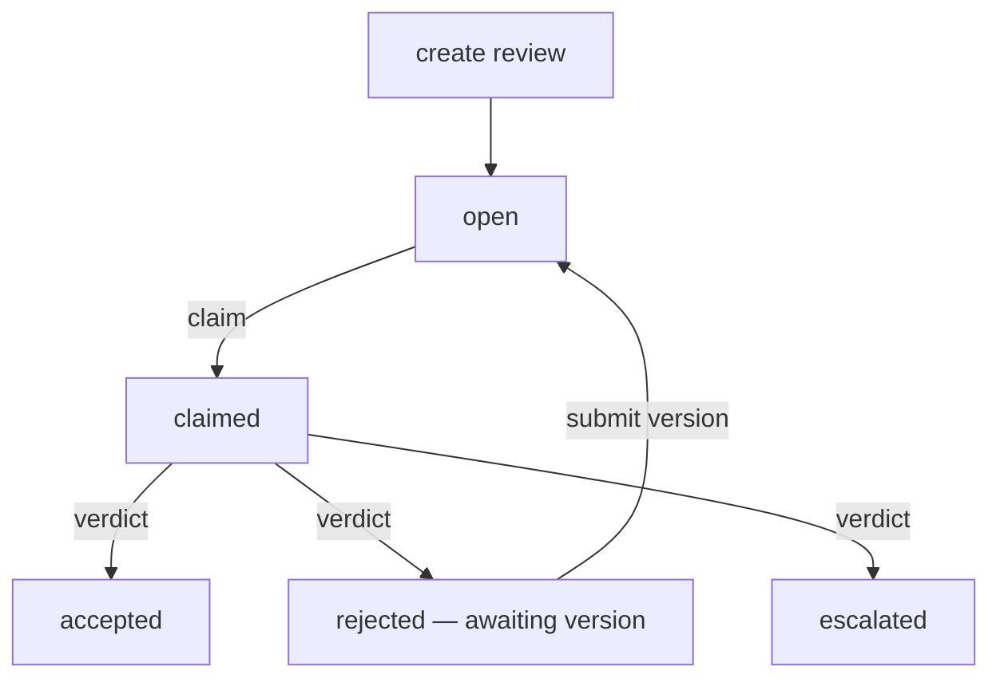

# Vobo

Human <ins>Review</ins> for AI ~~Slop~~ Output

No matter what your AI does – text, image, sounds or video – Vobo helps you review its products before slop goes live.

Each Vobo queue receives input and output of your model and lets your reviewers check it against policy. All decisions are stored in a hashed chain of evidence and can be POSTed wherever you want.

We don't replace your eval tools. We make human review convenient, so you don't footgun yourself.

_The name comes from *visto bueno* (V°B°) — the Latin-American sign-off “seen-good”._

[vobo.dev](https://vobo.dev/?utm_source=github&utm_medium=readme&utm_campaign=repo) · [Docs](https://vobo.dev/docs/quickstart) · [X](https://x.com/voboreview) · [LinkedIn](https://linkedin.com/company/voboreview)

## Features

- **Anchored comments.** A comment sticks to a place in the artifact. It stays across versions until someone resolves it.
- **Data in and data out.** HTTP, MCP, and webhooks. You POST an artifact. You get a signed decision back.
- **Hotkeys.** The station is built for the keyboard. `⌘↵` ships a verdict.
- **Access control.** Admin and reviewer roles on every plan.
- **Text now, image WIP.** Sound and video are on the roadmap.
- **Retrievable traces.** Every decision is on a hash chain. You can pull the full record.

## The loop



`create review` is an idempotent upsert on the caller's request id. `submit version` never creates a request. `accepted` is terminal: do not regenerate it.

## Get started

### Managed cloud

Sign up on [vobo.dev](https://vobo.dev/?utm_source=github&utm_medium=readme&utm_campaign=repo&utm_content=get-started).

Free is 1 queue and 1 000 reviews a month. Paid is $0.10 per human review.

The LLM judge is on the roadmap. It will be free on any plan when you bring your own key. Paid will also let you use our tokens, charged per review.

Setup is in the [docs](https://vobo.dev/docs/quickstart).

### Enterprise

Open-core self-host is capped at 20 queues. If you need more than 20, write to [v@vobo.dev](mailto:v@vobo.dev) for an enterprise licence.

### Run it locally

You need Node.js 22+, [pnpm](https://pnpm.io), and Postgres.

```bash
git clone https://github.com/getbeton/vobo.git
cd vobo
pnpm install
cp .env.example .env
```

Set `AUTH_SECRET` (`openssl rand -base64 32`) and `POSTGRES_URL`. Then:

```bash
pnpm db:migrate
pnpm db:seed          # prints the admin password and API key once
pnpm dev              # http://localhost:3000
pnpm worker           # webhooks, lease expiry, SLA sweep — second process
```

`pnpm db:seed` writes one workspace, the default queue, and one project-scoped API key. Store the key. It is not shown again.

Without `RESEND_API_KEY`, magic links print to the server log. That is enough for local work.

Production topology, Railway, and DNS live in [`DEPLOY.md`](./DEPLOY.md).

## Connect a pipeline

Same contract on every path. Ids belong to the caller and must be deterministic.

| Path | Use when |
|---|---|
| **HTTP** `Bearer` on `/api/v1/reviews`, `/api/v1/versions`, `/api/v1/corrections`, `/api/v1/review`, `/api/v1/cursor` | Any pipeline |
| **MCP** `request_review`, `submit_version`, `list_reviews`, `get_review`, `get_corrections`, `get_cursor`, `set_cursor` | An agent in a terminal. Full-loop parity with HTTP |
| **Webhooks** Standard Webhooks signing, retry 10s / 60s / 180s, then DLQ | You have a server that can receive events |

A consumer with no server **pulls**. `changed_since` takes an event-id cursor that Vobo stores per API key. `awaiting_version` is the regeneration work list. Two copies of the same agent cannot drift: there is no local cursor.

Point the MCP server at an instance:

```bash
export VOBO_API_URL=http://localhost:3000
export VOBO_API_KEY=vobo_sk_…
pnpm mcp
```

## Community

| Channel | Best for |
|---|---|
| [vobo.dev/docs/quickstart](https://vobo.dev/docs/quickstart) | How to use the station |
| [GitHub Issues](https://github.com/getbeton/vobo/issues/) | Bugs and errors in this repo |
| [X](https://x.com/voboreview) | Product notes |
| [LinkedIn](https://linkedin.com/company/voboreview) | Company notes |

## Contributing

Open a pull request against `staging`. Run `pnpm test` first.

Do not invent UI. The prototype in `design/` is the spec.

## License

[Apache License 2.0](./LICENSE)

## OSS tooling

These projects run the station. Thank you.

| Project | In Vobo | Links |
|---|---|---|
| [Next.js](https://nextjs.org) | The app | [repo](https://github.com/vercel/next.js) |
| [React](https://react.dev) | UI | [repo](https://github.com/facebook/react) |
| [Drizzle](https://orm.drizzle.team) | Schema and queries | [repo](https://github.com/drizzle-team/drizzle-orm) |
| [Better Auth](https://www.better-auth.com) | Sessions and magic links | [repo](https://github.com/better-auth/better-auth) |
| [MCP TypeScript SDK](https://modelcontextprotocol.io) | The MCP server | [repo](https://github.com/modelcontextprotocol/typescript-sdk) |
| [Zod](https://zod.dev) | Request and event shapes | [repo](https://github.com/colinhacks/zod) |
| [Tailwind CSS](https://tailwindcss.com) | Layout | [repo](https://github.com/tailwindlabs/tailwindcss) |
| [postgres.js](https://github.com/porsager/postgres) | Postgres client | [repo](https://github.com/porsager/postgres) |
| [pg-boss](https://github.com/timgit/pg-boss) | Jobs: webhooks, leases, SLA | [repo](https://github.com/timgit/pg-boss) |
| [Radix UI](https://www.radix-ui.com) | Accessible primitives | [repo](https://github.com/radix-ui/primitives) |
| [Lucide](https://lucide.dev) | Icons | [repo](https://github.com/lucide-icons/lucide) |
| [SWR](https://swr.vercel.app) | Client data | [repo](https://github.com/vercel/swr) |
| [Vitest](https://vitest.dev) | Tests | [repo](https://github.com/vitest-dev/vitest) |
| [approx-string-match](https://www.npmjs.com/package/approx-string-match) | Re-anchoring after a rewrite | [repo](https://github.com/robertknight/approx-string-match-js) |

VOBO Oversees Bullshit Output
